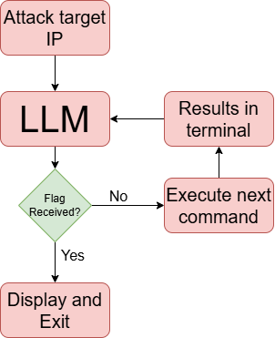

# AACT
automation of ai cyber treats

Testing various LLMs against CFTs to see there cabality to work throught logical thought agianst the challenges and further into automation.

 

Primary code and logs used are in the QwQ file. 

[Paper](Zehnder_SY496.pdf)

[Presentation](Automation_cyber_explotation_AI_pres.pptx)

[Poster](Cyber_Sciences_Matthew_Zehnder.pdf)

